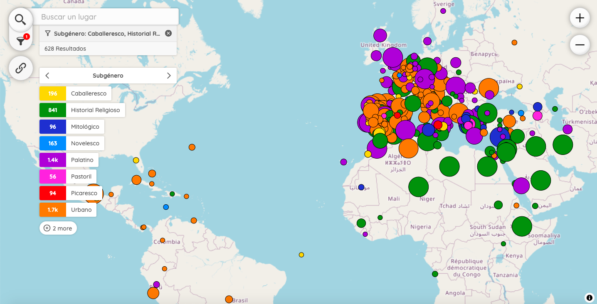

# Peripleo | Mapping Lope: A Cartographic Exploration of the Comedia Nueva 🌍

_Mapping Lope: A Cartographic Exploration of the Comedia Nueva_ (2025–2027) is a Swiss National Science Fund (SNSF) funded project that uses Digital Humanities tools to analyze the use of place names (toponyms) in Lope de Vega’s plays. Combining Philology, Literary Geography, and machine learning, it aims to reassess the link between theater genres and geography, and to explore how toponyms reflect the political and cultural context of Lope’s time. Through automated extraction of place names, interactive maps, graphs, and statistics, the project offers new insights into the role of space in Spanish Golden Age drama.

This [map](https://mappinglope.github.io/peripleo-lope) shows the names of the places detected with machine learning in 364 plays. With this visualisation, users can search places and filter them by genre, subgenre, title, date, etc.

Peripleo is a prototype application for the discovery and spatial visualisation of collection data, originally an initiative of the Pelagios Network and developed early in 2022 as part of the British Library's Locating a National Collection project (LaNC).

## LinkedPlaces Data

Our [LP-Format](https://github.com/LinkedPasts/linked-places-format) data can be found [here](https://github.com/MappingLope/peripleo-lope/tree/main/docs/data). To extract the place names in our corpus we have developed our own [NER model](https://github.com/MappingLope/LOPE_NER).

## Code Reuse

Our javascript implementation of Peripleo can be found [here](https://github.com/MappingLope/peripleo-lope/tree/main/src). It is a slightly different version from the original Peripleo.

## Installation

See the *Peripleo* instructions for the visualisation of your own geospatial data:
1. the [Installation Guide](https://github.com/britishlibrary/peripleo/blob/main/README.md), and
2. the [Configuration Guide](https://github.com/britishlibrary/peripleo/blob/main/Configuration-Guide.md).
